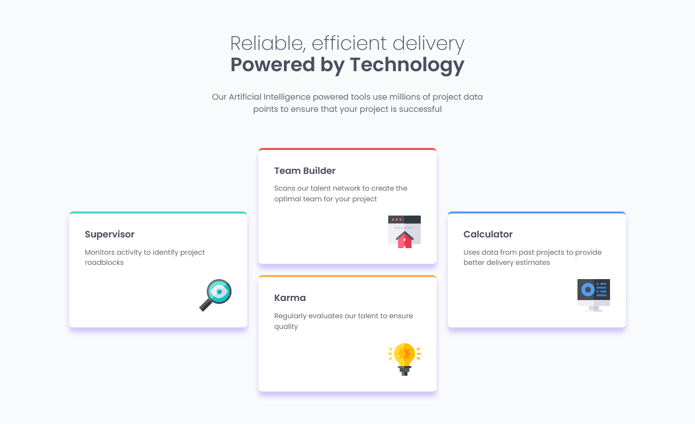

# Frontend Mentor - Solução da seção de recursos em quatro cards

Esta é uma solução para o desafio **Four Card Feature Section** do [Frontend Mentor](https://www.frontendmentor.io).  
Os desafios do Frontend Mentor ajudam você a melhorar suas habilidades de programação construindo projetos realistas.

---

## Sumário

- [Frontend Mentor - Solução da seção de recursos em quatro cards](#frontend-mentor---solução-da-seção-de-recursos-em-quatro-cards)
  - [Sumário](#sumário)
  - [Visão geral](#visão-geral)
    - [Screenshot](#screenshot)
    - [Links](#links)
  - [Meu processo](#meu-processo)
    - [Construído com](#construído-com)
    - [O que aprendi](#o-que-aprendi)
    - [Desenvolvimento contínuo](#desenvolvimento-contínuo)
    - [Recursos úteis](#recursos-úteis)
  - [Autor](#autor)
  - [Agradecimentos](#agradecimentos)

---

## Visão geral

### Screenshot

---

### Links

- URL da solução: *(adicione aqui o link da sua solução no Frontend Mentor)*  
- URL do site ao vivo: *(adicione aqui o link do site publicado)*

---

## Meu processo

### Construído com

- HTML5 semântico
- CSS Grid
- Propriedades personalizadas do CSS
- Abordagem desktop-first
- Design responsivo

---

### O que aprendi

Neste projeto, desenvolvi uma **seção de recursos composta por quatro cards**, utilizando uma abordagem **desktop-first**, com foco em:

- Criação de layouts assimétricos com CSS Grid
- Organização visual de múltiplos componentes
- Controle de alinhamento e espaçamento
- Uso de Grid
- Fidelidade ao design proposto pelo desafio

Esse desafio foi essencial para consolidar o uso de **CSS Grid em layouts reais e modernos**.

---

### Desenvolvimento contínuo

Em projetos futuros, pretendo:

- Explorar ainda mais layouts baseados em grid
- Refinar a responsividade partindo do desktop
- Criar padrões reutilizáveis para seções de destaque
- Melhorar acessibilidade em componentes visuais
- Evoluir a arquitetura do CSS

---

### Recursos úteis

- MDN Web Docs – Referência essencial para HTML e CSS  
- Frontend Mentor – Plataforma excelente para prática com projetos reais  
- CSS-Tricks – Conteúdos aprofundados sobre CSS Grid e layout  

---

## Autor

- GitHub – https://github.com/lanzincode
- Frontend Mentor – https://www.frontendmentor.io/profile/lanzincode

---

## Agradecimentos

Agradecimentos ao **Frontend Mentor** por disponibilizar desafios bem estruturados, ideais para praticar layouts modernos e aprofundar conhecimentos em CSS Grid.
